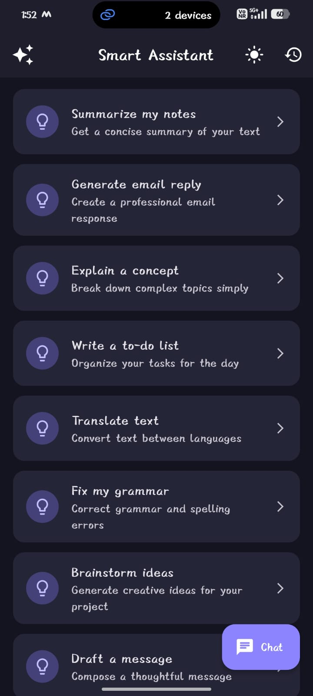
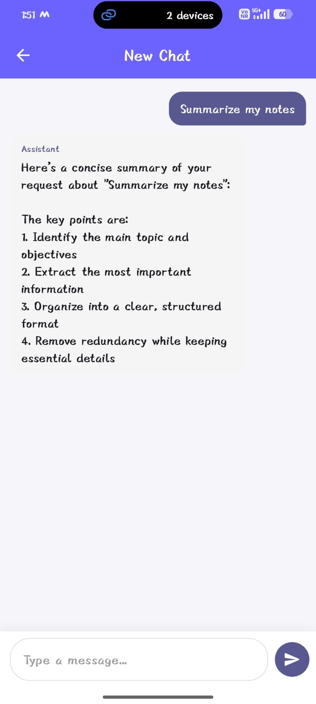
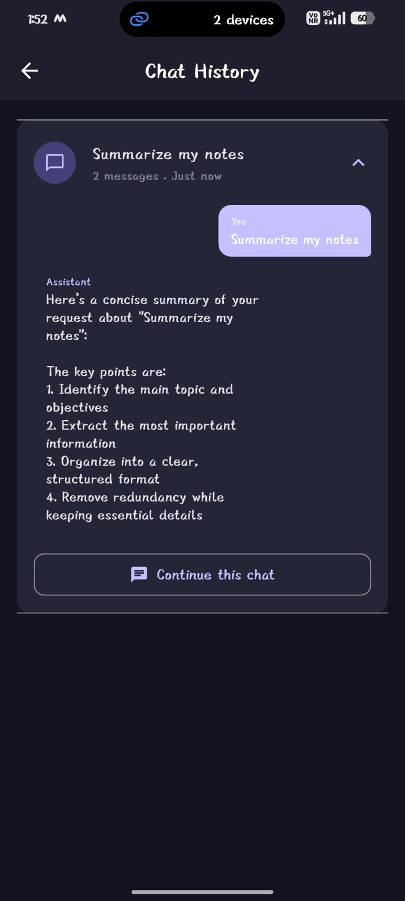
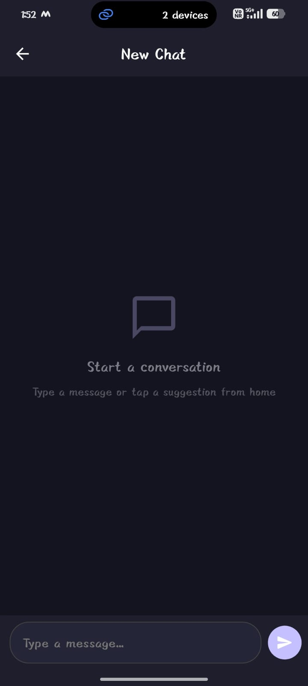
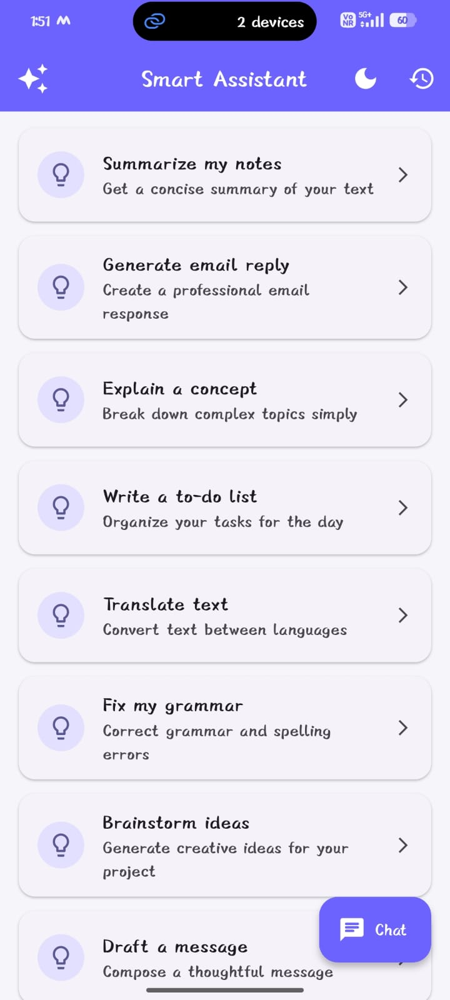

# 🤖 Smart Assistant

A **Flutter-based AI chatbot assistant** application with a clean, modular architecture. The app simulates a conversational AI experience with context-aware replies, session-based chat history, paginated suggestions, and dark/light theme support — all powered by a service-oriented API layer and local persistence.

---

## ✨ Features

| Feature | Description |
|---|---|
| 💬 **AI Chat** | Real-time conversational interface with context-aware, topic-based smart replies |
| 💡 **Smart Suggestions** | Paginated list of 50+ prompt suggestions fetched from the API layer (infinite scroll) |
| 📜 **Chat History** | Session-based history with expandable conversation previews and "Continue Chat" |
| 🌗 **Dark / Light Theme** | Toggle between dark and light modes with a polished Material 3 design |
| 💾 **Persistent Storage** | All chat sessions and messages are stored locally using Hive |
| 🔄 **Session Management** | Each conversation is a distinct session — no merging, full isolation |
| ⚡ **Typing Indicator** | Animated bouncing dots shown while the assistant is "thinking" |
| 🔁 **Error Handling** | Graceful error states with retry mechanisms on every screen |

---

## 🏗️ Architecture

The project follows a **feature-first architecture** with a clear separation of concerns:

```
lib/
├── main.dart                         # App entry point & ProviderScope
├── core/
│   ├── api/
│   │   └── api_service.dart          # Centralized API layer (simulated)
│   ├── storage/
│   │   └── chat_storage.dart         # Hive-based local persistence
│   └── theme/
│       └── app_theme.dart            # Light & Dark theme definitions
└── features/
    ├── home/
    │   ├── model/suggestion_model.dart
    │   ├── provider/home_provider.dart
    │   └── view/home_screen.dart
    ├── chat/
    │   ├── model/chat_model.dart
    │   ├── provider/chat_provider.dart
    │   └── view/chat_screen.dart
    └── history/
        ├── model/history_model.dart
        ├── provider/history_provider.dart
        └── view/history_screen.dart
```

### Key Design Decisions

- **Feature-first structure** — Each feature (`home`, `chat`, `history`) is self-contained with its own `model`, `provider`, and `view` layers.
- **Riverpod for state management** — `StateNotifierProvider` is used for reactive, testable state handling across all features.
- **API service layer** — A centralized `ApiService` simulates real REST API behavior with delays, pagination, and structured JSON responses, making it trivial to swap in a real backend.
- **Hive for local storage** — Chat sessions and messages are persisted locally using Hive, ensuring data survives app restarts.

---

## 🛠️ Tech Stack

| Technology | Purpose |
|---|---|
| [Flutter](https://flutter.dev/) | Cross-platform UI framework |
| [Dart](https://dart.dev/) | Programming language |
| [Riverpod](https://riverpod.dev/) (`flutter_riverpod`) | State management |
| [Hive](https://docs.hivedb.dev/) (`hive` + `hive_flutter`) | Lightweight local NoSQL storage |
| [Dio](https://pub.dev/packages/dio) | HTTP client (available for real API integration) |
| [Material 3](https://m3.material.io/) | Design system |

---

## 🚀 Setup & Installation

### Prerequisites

- **Flutter SDK** ≥ 3.6.0  
- **Dart SDK** ≥ 3.6.0  
- Android Studio / VS Code with Flutter extension  
- An emulator or physical device (Android / iOS / Web / Desktop)

### Steps

```bash
# 1. Clone the repository
git clone https://github.com/Dynamic2611/smart_assistant.git
cd smart_assistant

# 2. Install dependencies
flutter pub get

# 3. Run the app
flutter run
```

> **Note:** No additional configuration or API keys are required. The app uses a simulated API layer out of the box.

---

## 📱 App Screens

### Home Screen
- Displays a paginated list of smart suggestions fetched from the API
- Infinite scroll for seamless browsing
- Tap any suggestion to start a chat with it as the initial message
- Dark/Light theme toggle in the app bar
- Quick access to Chat History


### Chat Screen
- Send messages and receive intelligent, context-aware replies
- Animated typing indicator while the assistant processes a response
- Supports both new conversations and resuming existing sessions
- Messages are auto-persisted to local storage

### History Screen
- View all past chat sessions sorted by recency
- Each session shows a preview title (derived from the first user message) and message count
- Expand any session to see the full conversation inline
- "Continue this chat" button to resume any previous conversation

---

## 📱 Screenshots


<p align="center">
  
  
  
</p>

<p align="center">
  
  
</p>

---
## 🔌 API Layer

The `ApiService` class simulates a real backend API with:

| Endpoint | Method | Description |
|---|---|---|
| `getSuggestions()` | Paginated | Returns 10 suggestions per page (50 total) with full pagination metadata |
| `sendMessage()` | Async | Sends a user message and returns a context-aware reply |
| `getChatHistory()` | Async | Returns all stored chat sessions from Hive |
| `getSessionMessages()` | Async | Returns all messages for a specific session |

> 💡 **Ready for real integration** — Replace the simulated responses in `ApiService` with actual HTTP calls using the already-included `Dio` package.

---

## 🎨 Theming

The app ships with two carefully crafted themes defined in `app_theme.dart`:

| Attribute | Light | Dark |
|---|---|---|
| Primary | `#6C63FF` | `#8B83FF` |
| Background | `#F5F5FA` | `#141420` |
| Surface/Card | `White` | `#252538` |
| Design System | Material 3 | Material 3 |

Both themes include custom styles for AppBar, Cards, FAB, Input Fields, and ListTiles.

---

## 📂 Key Files

| File | Responsibility |
|---|---|
| `lib/main.dart` | App initialization, Hive setup, theme binding |
| `lib/core/api/api_service.dart` | Simulated API with smart reply generation |
| `lib/core/storage/chat_storage.dart` | Hive CRUD operations for sessions & messages |
| `lib/core/theme/app_theme.dart` | Light & Dark `ThemeData` definitions |
| `lib/features/home/provider/home_provider.dart` | Paginated suggestion fetching logic |
| `lib/features/chat/provider/chat_provider.dart` | Chat session & messaging state management |
| `lib/features/history/provider/history_provider.dart` | History fetching & state management |

---

## 🧪 Running Tests

```bash
flutter test
```

---

## 📄 License

This project is for demonstration and interview purposes.

---

<p align="center">
  Built with ❤️ using Flutter & Dart
</p>
